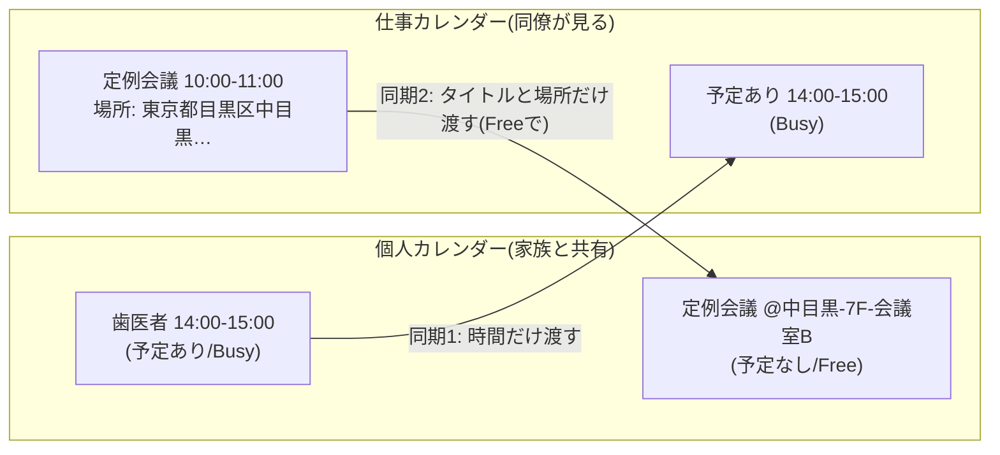

# いえとしごと

個人と仕事の Google カレンダーを、ちょうどよく自動同期する Google Apps Script です。

## 何を解決するのか

個人の予定は個人のカレンダーに、仕事の予定は仕事のカレンダーに入れている人は、こんなすれ違いを経験します。

- 同僚:「その時間、カレンダー空いてましたよね?」(個人の予定が仕事側から見えない)
- 家族:「なんでその日ダメなの? 何の予定なの?」(仕事の予定が家族から見えない)

かといって、個人の予定を仕事のカレンダーにそのまま載せたくはありません。通院も、子どもの行事も、同僚に知らせる必要はないからです。

「いえとしごと」は、2つのカレンダーの間で **渡す情報の量を変えて** 同期します。

1. **個人のプライバシーを守る** — 仕事のカレンダーに渡すのは「時間」だけ。個人の予定は、内容を一切載せず「予定あり」というブロックになります。同僚に伝わるのは空き状況だけです。
2. **仕事の説明責任を果たす** — 個人のカレンダーには、仕事の予定のタイトルと場所を載せます。家族がカレンダーを見れば「いつ・どこで・何の仕事があるのか」が分かります。渡すのはそこまでで、説明文・参加者・添付資料・会議 URL は渡しません。家族に説明できて、仕事の中身は持ち出さない、というバランスにしています。
3. **家庭の平和を保つ** — この2つによって、仕事と家庭の間の「なんでその時間ダメなの?」をなくします。

## 2つの同期

| | 同期1: 個人 → 仕事 | 同期2: 仕事 → 個人 |
|---|---|---|
| 目的 | プライバシー保護 | 説明責任 |
| 渡すもの | **時間だけ** | **タイトルと場所だけ**(説明文・参加者などは渡さない) |
| 相手側での見え方 | 「予定あり」(Busy) | 「元タイトル @場所ラベル」(Free) |
| 相手側の空き状況 | ブロックする | **邪魔しない** |

仕事側に渡るのは時間だけ。個人側には予定のタイトルが渡るけれど、Free(予定なし)なので個人側の空き状況は変わりません。家族との予定調整を妨げず、同期1に拾われて仕事側へ戻ることもありません。この「Free でコピーする」が、2つの同期が無限ループしない仕組みの核です。

### 同期1(個人 → 仕事)の詳細

- 個人カレンダーの Busy の予定を、仕事カレンダーに「予定あり」ブロックとして作成します
- 重なっている予定・連続している予定は **1つのブロックにまとめます**(ブロックの件数から予定の中身を推測されにくくするため)
- Busy の終日予定は、丸1日のブロックになります
- 次の予定は対象外です: Free(予定なし)の予定/辞退した予定/仕事用アドレスが参加者・主催者に含まれる予定(仕事側に原本があるため)

### 同期2(仕事 → 個人)の詳細

- 個人アドレスが招待されていない仕事の予定を、個人カレンダーに Free の予定としてコピーします
- タイトルは「元タイトル @場所ラベル」になります
  - 住所や会議室名があればそれを優先し、短くします(例: 「東京都目黒区中目黒1-2-3 ○○ビル7F 会議室B」→「@中目黒-7F-会議室B」)
  - 物理的な場所がなく会議 URL だけなら「@Google Meet」「@Zoom」「@Teams」
- 仕事側で予定が変更・削除されると、コピーも追従します
- 参加者はコピーしません(招待メールが飛ぶ事故を防ぐため)。通知も付けません
- 次の予定は対象外です: Free の予定/辞退した予定/個人アドレスも招待されている予定(個人側に原本があるため)

どちらも 15 分ごとに自動実行され、60 日先までの予定を同期します。

## 動かすための条件

- スクリプトは **個人の Google アカウント(Gmail)** で動かします。個人カレンダーを誰かに共有する必要はありません
  - Google の「高度な保護機能プログラム」に加入しているアカウントでは動かせません(自作の GAS も未審査アプリとして承認がブロックされます)
- 仕事カレンダーを、個人アカウントへ **「予定の変更」権限** で共有できること
  - 仕事の予定の詳細を読み、「予定あり」ブロックを書き込むために必要です
  - 会社の Google Workspace が外部アカウントへの共有を「空き時間情報のみ」に制限している場合は使えません。共有設定の画面で「予定の変更」を選べるかどうかで確認できます
- 仕事の予定のタイトルと場所が個人の Google アカウントに保存されます。**勤務先の情報管理ルール上問題がないか、事前に確認してください**

## セットアップ

3 ステップ、10〜15 分で終わります。画面つきの詳しい手順は [docs/setup.md](docs/setup.md) にあります。

1. **共有する** — 仕事カレンダーを、個人の Gmail アドレスへ「予定の変更」権限で共有する
2. **貼り付ける** — 個人アカウントの [script.google.com](https://script.google.com) で新しいプロジェクトを作り、`src/` の 4 ファイルを貼り付ける。`config` の `WORK_EMAIL` を仕事用アドレスに書き換え、「サービス」に Google Calendar API(識別子 `Calendar`)を追加する
3. **動かす** — `syncBusyBlocksSafe` を 1 回実行して結果を確認し、`setupTrigger` を 1 回実行する。以後は 15 分ごとに自動で同期されます

承認画面で「This app is blocked」と表示されて進めない場合は、[docs/setup.md の対処手順](docs/setup.md#承認画面でthis-app-is-blockedこのアプリはブロックされますと出たとき) を見てください。

**初回実行でレート制限のエラーが出るのは正常です。** 60 日分の予定を一度に作るため、Google 側の制限に当たることがあります。作れた分は残り、続きは次回以降の実行で自動的に作られます。何もしなくて大丈夫です。

書き換える設定は `WORK_EMAIL` だけです。同期する日数、ブロックのタイトル、実行間隔、オンライン会議の判定パターンなどは、変えたい人だけ `config.gs` でカスタマイズできます([src/config.example.gs](src/config.example.gs))。

## 運用ルール

- **同期が作った予定を手で編集しない。** 仕事側の「予定あり」も、個人側の仕事予定コピーも、スクリプトの管理物です。手で編集・複製・移動すると、識別用のタグが外れて管理から漏れた予定(孤児)が残ることがあります
- **ブロックを動かしたいときは、個人側の元の予定を動かす。** 次回の同期でブロックも動きます。同様に、コピーを直したいときは仕事側の元の予定を直します
- **孤児が出たら**: `debugInspectBlocks` を実行すると、実行ログに「★孤児候補」として表示されます。内容を確認して、カレンダー上で手動削除してください
- **「なぜこの予定が同期されないのか」を調べたいとき**: `debugInspectEvents` を実行すると、各予定が対象か対象外か(とその理由)が実行ログに出ます
- 診断用の 2 つの関数はカレンダーを読むだけで、何も変更しません

## エラーが起きたとき

- Google 側の一時的なエラー(応答なし、Backend Error、レート制限など)は、間隔を空けて 3 回まで再試行します。それでも失敗したら、何も通知せず次回の実行に任せます
- 設定ミスや権限不足など、待っても直らないエラーだけを、実行アカウント(個人の Gmail)宛てにメールで通知します。同じ内容のエラーは 6 時間に 1 回だけ通知します

## FAQ

**Q. ブロックのタイトル(`BLOCK_TITLE`)を後から変えたい**
変更後に作られるブロックから新しいタイトルになります。作成済みのブロックは旧タイトルのまま残り、旧タイトルのブロックが個人側へコピーされてしまうので、変更するときは既存のブロックをカレンダー上で削除してください(次回の同期で作り直されます)。

**Q. 仕事先が複数ある(副業・兼務など)**
`config.gs` で `WORK_EMAIL` の代わりに `WORKS` を指定すると、複数の仕事カレンダーと同期できます(書き方は [src/config.example.gs](src/config.example.gs))。それぞれの仕事カレンダーを、個人アカウントへ「予定の変更」権限で共有してください。

- 個人側のコピーには、`label` で指定した目印が付きます(例: 「[A] 定例会議 @中目黒」)
- 仕事先 B の会議は、仕事先 A のカレンダーでは「予定あり」になります(逆も同じ)。個人の予定とまとめて 1 つのブロックになるので、A からは B の予定の存在も中身も分かりません
- どれか 1 つのカレンダーでも読めないときは、誤って予定を消さないよう、その回の同期を丸ごと中止します。退職などで共有が切れたら、`WORKS` からその仕事先を外してください

**Q. 実行間隔を変えたい**
`config.gs` の `TRIGGER_MINUTES` を変えて、`setupTrigger` をもう一度実行してください。指定できるのは 1 / 5 / 10 / 15 / 30 分です。

**Q. `setupTrigger` を実行したら、ほかのトリガーが消えた**
`setupTrigger` は、そのプロジェクトのトリガーをすべて削除してから作り直します。「いえとしごと」専用のプロジェクトで使ってください。

**Q. 場所ラベルが変になる**
住所からの地名抽出は簡易的なものです。政令指定都市の住所では区名が残る(「大阪市北区梅田」→「北区梅田」)など、きれいに取れない住所があります。

**Q. 海外のタイムゾーンで使える?**
使えません。日本(Asia/Tokyo)での利用を前提にしていて、プロジェクトのタイムゾーンが東京以外だとエラーで止まります(終日予定のブロックの日付がずれるのを防ぐためです)。

**Q. やめたいとき**
GAS のトリガーを削除すれば同期は止まります。作成済みのブロックとコピーは残るので、不要ならカレンダー上で削除してください。

**Q. コードを更新したいとき**
`main.gs` `workToPersonal.gs` `debug.gs` を新しい内容で貼り直してください。`config.gs` はそのままで構いません。

**Q. clasp で管理したい**
公式の導入手順はコピペのみです。clasp を使う場合は、`src/config.example.gs` を push 対象から外してください(`config.gs` と `CONFIG` が二重定義になり動かなくなります)。それ以外はサポート外です。

## 注意事項

- 本ツールは個人が作成した非公式のツールで、Google とは関係ありません
- 仕事カレンダーの「予定あり」ブロックには、作成者として個人の Gmail アドレスが記録されます。予定の詳細を開ける同僚には、このアドレスが見えます(予定の中身は見えません)。カレンダーの持ち主以外は予定を「限定公開」にできないという Google カレンダーの制約によるものです
- カレンダーの予定を自動で作成・更新・削除します。利用は自己責任でお願いします。予定の消失や情報の露出など、本ツールの利用によって生じたいかなる損害についても、作者は責任を負いません
- 勤務先の規程(外部サービスの利用、社外への情報持ち出し)に反しないことを、ご自身で確認してください

## プライバシー

このスクリプトは利用者自身の Google アカウントの中だけで動き、作者を含む第三者にデータを送りません。詳しくは [PRIVACY.md](PRIVACY.md) を見てください。

## ライセンス

[MIT License](LICENSE)
